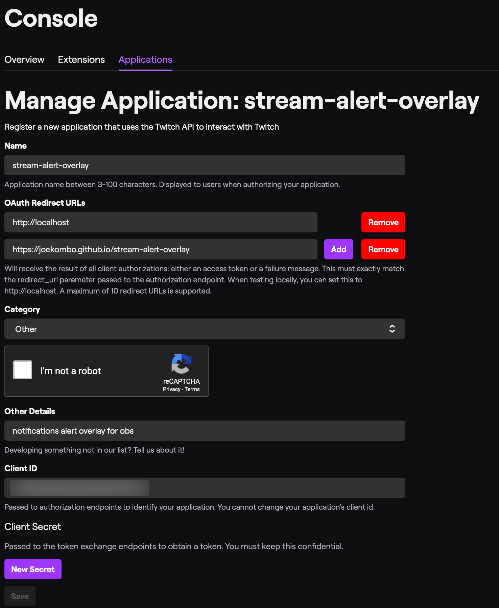

# Stream Alert Overlay

A simple follower alert overlay for OBS that displays a list of the latest followers approximately every 60 seconds.

_Note: This project uses the `docs/` folder for web related files: `.html`, `.css`, `.js` etc. I do this because the project is hosted on [github pages](https://pages.github.com/)._

## Parameters

### `login`

Default `joekombo`. Enter the login name for a Twitch user.

### `volume`

Default `25`. Percentage from `0` to `100`.

### `sound`

Default `guitar`. Must match a filename found in `docs/sounds`

### `gif`

Default `guitarkitty`. Positioned in the bottom left of screen. Must match a filename found in `docs/images`.

### `clientid`

Required. [Create an application at dev.twitch.tv](https://dev.twitch.tv) and use that client id for `clientid`.

## Example

`https://joekombo.github.io/stream-alert-overlay/?login=joekombo&clientid=[your client id]`

## Testing notifications are working using another streamer name
Use another streamer's login name to test that notifcations are working. Example: `login=summit1g`

_Note: Be patient.  The notifications may take up to 60 seconds to show for the first time.  **Before going live change name back to your login!**_

## Application Settings

I use the following application settings at [dev.twitch.tv](https://dev.twitch.tv) to obtain my Client ID. The Client ID can be found near the bottom.



## Run locally

Clone the project using [git](https://git-scm.com). And then change the directory to the project folder.

```
git clone https://github.com/joekombo/stream-alert-overlay
cd stream-alert-overlay
```

Install the depedencies using [npm](https://www.npmjs.com/) and use `npm start` to serve the files.

```
npm install
npm start
```

Go to web browser and view the page.

Example URL:

`http://localhost:5000/?login=joekombo&clientid=[your client id]`

_Note: Some browsers require permission to play sound. Click the tab and select allow audio/video._

## OBS

Create a `Browser` source, input the URL, and then set the width to 1920 and height to 1080.

## Contributions

To contribute changes, please [fork the repository](https://help.github.com/en/github/getting-started-with-github/fork-a-repo), make the changes, and then [create a pull request](https://help.github.com/en/github/collaborating-with-issues-and-pull-requests/creating-a-pull-request)! Thank you!.

_Note: [This project uses Prettier](https://prettier.io/) to format the code automatically when new code is commited. No additional steps are needed for this to work. More details about how this is setup is found [here](https://create-react-app.dev/docs/setting-up-your-editor/#formatting-code-automatically)._

## Issues

Something not working, or you're getting errors? Then please [submit an issue](https://help.github.com/en/github/managing-your-work-on-github/creating-an-issue).
